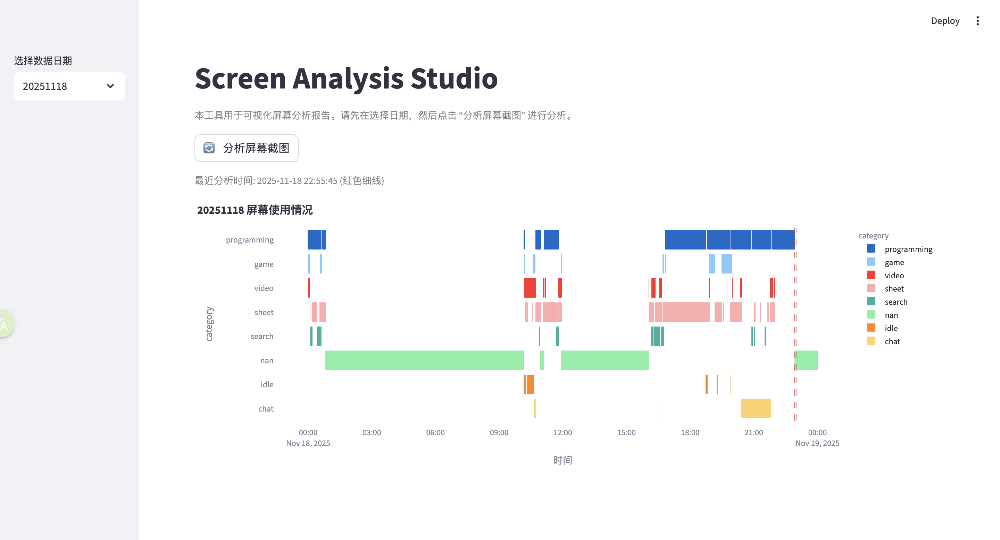

# Silent Screen Label

中文文档: [请点击这里](README.zh.md)

Unobtrusive screen usage tracking that runs quietly in the background.

- 🤫 Background auto-capture every minute, no manual start/stop.
- 🔐 All data and analysis are fully local, no network, privacy-safe.
- 🔍 Lightweight CLIP-based labeling to detect current activity.
- 🔧 Configurable categories via prompt/label pairs.



## 1. Installation

Two steps:

1. Install Python dependencies
2. Download pre-trained model

### 1.1 Install Python dependencies

#### with `uv`
- Create venv and install
  - `uv venv`
  - `source .venv/bin/activate`
  - `uv pip install -e .`

#### with `pip`
- Create venv and install
  - `python -m venv .venv`
  - `source .venv/bin/activate`
  - `pip install -e .`

### 1.2 Download pre-trained model

- CLIP-ViT-B-32-laion2B-s34B-b79K
  - [Download](https://huggingface.co/laion/CLIP-ViT-B-32-laion2B-s34B-b79K/resolve/main/open_clip_pytorch_model.bin)
  - Place under `checkpoints/laion/CLIP-ViT-B-32-laion2B-s34B-b79K/`

## 2. Usage

Steps:

1. Configure (optional; defaults work)
2. Start background capture
3. Visualize timeline

### 2.1 Configuration

Controls:

1. Screenshot storage path
2. Category definitions
3. Model parameters

File path: `config.json` at project root
- Capture settings:
  - `cycle`: capture interval seconds (default `60`)
  - `dir`: output base directory (default project root)
- Model settings:
  - `batch_size`: inference batch size
  - `clip_weights`: local path to CLIP weights
  - `clip_agg`: CLIP prompt aggregation (`mean` default; `mean|sum|max`)
  - `linear_probe`: path to trained linear probe
  - `clip_prompts`: list of `{prompt, label}`

See defaults in [`config.json`](config.json).

Important:
- To enable classification, configure `clip_prompts` as `{prompt, label}` pairs.
- Each pair defines one category:
  - `prompt`: description of a screenshot
  - `label`: category name
- Multiple prompts may map to the same label, e.g.:
  - `{"prompt": "a screenshot of a video player", "label": "video"}`
  - `{"prompt": "a screenshot of a bilibili website", "label": "video"}`

### 2.2 Start background capture

You may need to grant screen capture permissions.

- Screenshots are saved to `{project_dir}/screenshots/<YYYYMMDD>`
- `sa run` or `python -m screen_analysis.main run`
- Flags:
  - `--cycle <seconds>` capture interval
  - `--dir <path>` output base directory
  - `--menubar` show macOS menu bar indicator

```bash
sa run
```

### 2.3 Visualization

Use Streamlit to visualize the timeline.

- Run `sa-studio` or `python -m screen_analysis.commands.studio.cli`
- Open `http://localhost:8501`

```bash
sa-studio
```

### 2.4 Manual analysis

Analyze screenshots and write reports to `reports/<YYYYMMDD>`.

- Run `sa analyze [YYYYMMDD]` or `python -m screen_analysis.main analyze [YYYYMMDD]`
- Flags:
  - `--debug` print per-image classification
  - `--clip-weights <path>` override CLIP weights
  - `--overwrite` force full analysis (ignore incremental)

Incremental analysis:
- When `reports/<YYYYMMDD>/executed_at.log` and the day’s `timeline.csv` exist, only screenshots captured after the last execution time are analyzed.
- Only new minutes’ `category` are updated; other rows remain unchanged.

### 2.5 Manual cleanup

Delete a day’s screenshots.

- `sa del -d 20251118` or `python -m screen_analysis.main del -d 20251118`

```bash
sa del -d 20251118
```

## 3. Tests

- Performance tests: see [Docs – Performance](docs/test.md#性能测试)
- Model quality evaluation: see [Docs – Model Eval](docs/test.md#模型评估)

## 4. Improving classification

If results are suboptimal, try:

1. Adjust categories
   - Review `clip_prompts` descriptions in `config.json`
   - Add/remove/edit prompts to better match your activities
2. Skip prompts, train and use a custom model (linear probe)
   - With ~100 labeled screenshots you can significantly improve results
   - See [Docs – Train Linear Probe](docs/linear-probe.md)